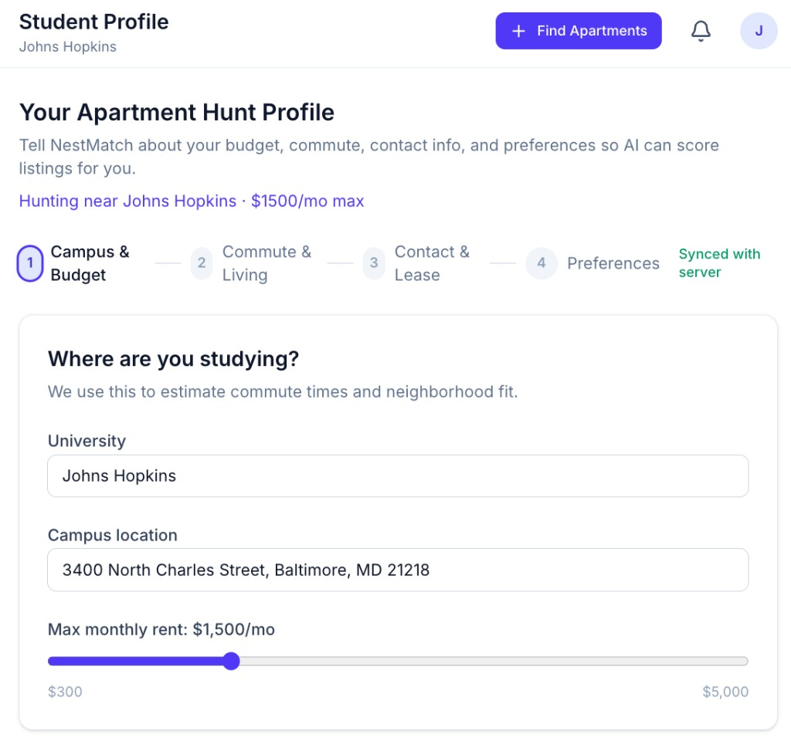
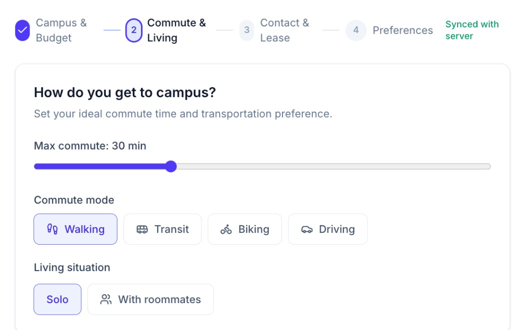
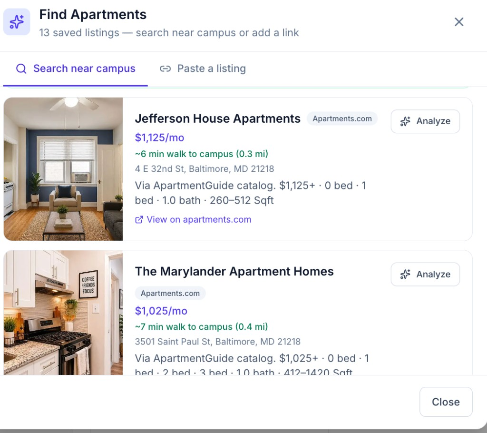
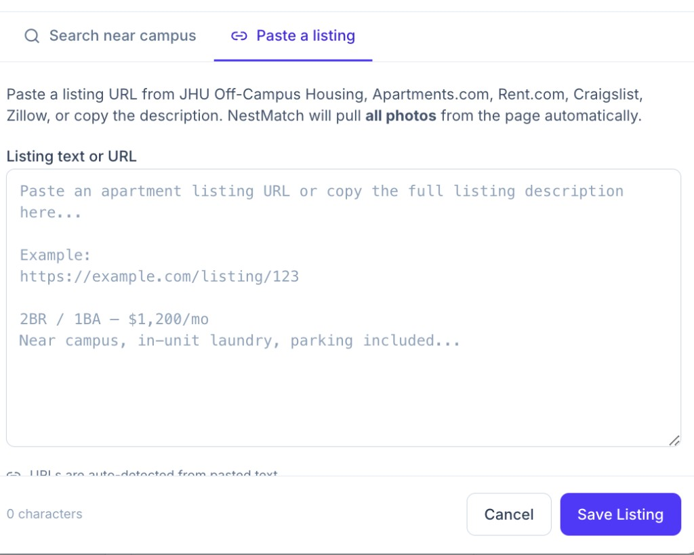
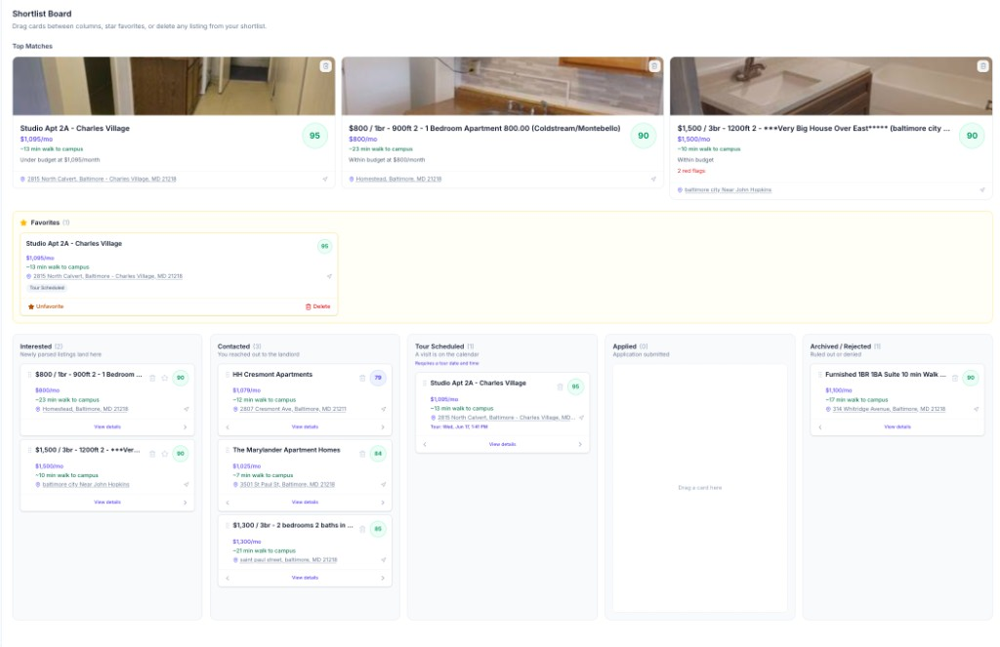
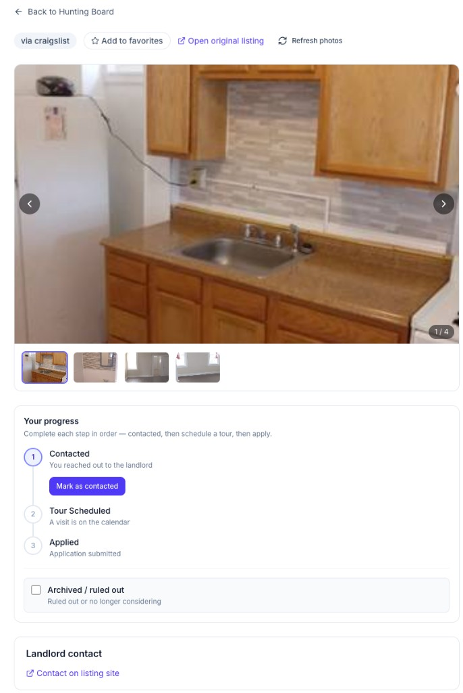
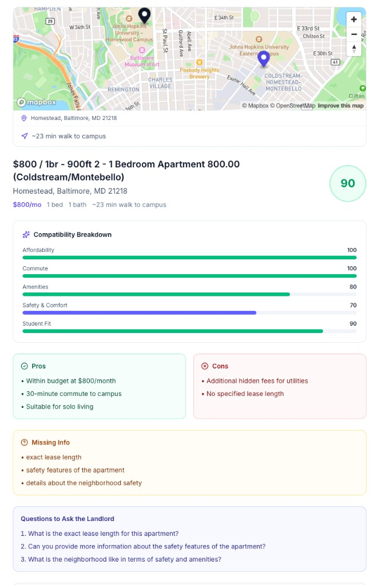
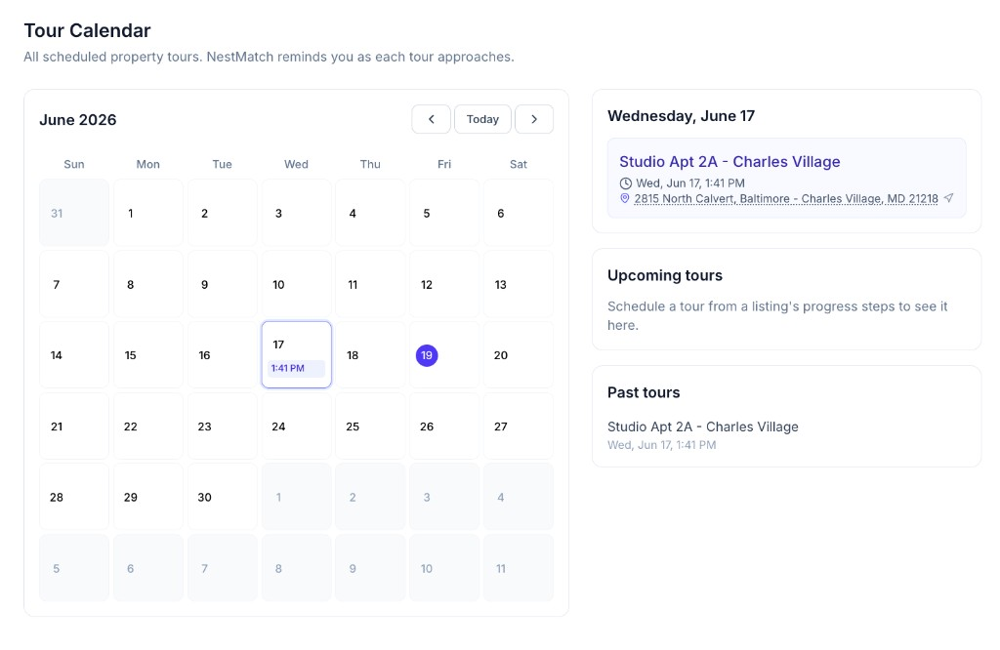

# NestMatch AI

AI-powered apartment hunting for college students. Set your profile once, search rental sites near campus, get compatibility scores, and track every listing from first look to lease signed.

**Live app:** http://localhost:5173 (after starting frontend + backend)

---

## How the App Works — User Workflow

Follow this path from sign-up to tour day. Each step below matches a screen in the app.

```
Profile setup → Find apartments → Analyze & score → Shortlist board → Listing detail → Tour calendar
```

### Step 1 — Set your campus & budget

Open **Student Profile** and complete the first step: where you study and what you can afford.



- Enter your **university** and **campus address** (used for commute estimates and map pins).
- Set your **max monthly rent** with the slider.
- Changes sync automatically to the server.

---

### Step 2 — Set commute & living situation

Continue to **Commute & Living** to tell NestMatch how you get to campus and who you're living with.



- **Max commute** — only listings within this time (walking, transit, biking, or driving) appear in search.
- **Commute mode** — pick how you usually travel to campus.
- **Living situation** — solo or with roommates (affects bedroom count and per-person rent math).

> **Tip:** If you change your profile later, previous search results are cleared. Click **Refresh for updated profile** in Find Apartments to search again.

---

### Step 3 — Find apartments near campus

Click **+ Find Apartments** in the top navbar to open the search modal.



NestMatch searches **JHU Off-Campus Housing**, **Apartments.com**, **Rent.com**, **Zillow**, **Craigslist**, **Realtor.com**, and (with OpenAI configured) **GPT web search**.

Each result shows:

- Monthly rent (with per-person split when you have roommates)
- **Commute time** to campus (e.g. "~6 min walk")
- Source site and street address

Click **Analyze** on any listing to score it against your profile, or **Search all sites near campus** / **Refresh for updated profile** to run a new search.

---

### Step 4 — Or paste a listing you found elsewhere

Use the **Paste a listing** tab if you already have a URL or copied description.



Paste a link from Craigslist, Zillow, Apartments.com, Rent.com, or JHU Off-Campus Housing — or paste the full listing text. NestMatch pulls **all photos** from the page and runs AI analysis automatically.

---

### Step 5 — Track listings on the Hunting Board

Saved and analyzed listings land on your **Shortlist Board** — a Kanban workflow from interest to application.



| Area | What it does |
|------|----------------|
| **Top Matches** | Highest compatibility scores at a glance |
| **Favorites** | Starred listings you want to keep handy |
| **Interested** | Newly analyzed listings start here |
| **Contacted** | You've reached out to the landlord |
| **Tour Scheduled** | A visit is on the calendar |
| **Applied** | Application submitted |
| **Archived / Rejected** | Ruled out or denied |

Drag cards between columns, star favorites, or delete listings you no longer want.

When analysis finishes, a toast appears: **"Scored … — 90/100"**. Tap it to jump straight to that listing.

---

### Step 6 — Work through each listing

Open any card to see photos, landlord contact, and your **progress steps**.



- Browse the **photo gallery** (with refresh from the original site).
- **Mark as contacted** when you've messaged the landlord.
- Schedule a **tour** from the progress steps.
- **Archive** listings you've ruled out.

---

### Step 7 — Review the AI compatibility analysis

Scroll down on a listing to see the full **analysis dashboard**.



- **Map** — apartment pin vs. campus pin with commute time.
- **Compatibility score** (0–100) with breakdown: Affordability, Commute, Amenities, Safety & Comfort, Student Fit.
- **Pros & cons** tailored to your profile.
- **Missing info** the listing didn't mention.
- **Questions to ask the landlord** — copy-ready follow-ups.

---

### Step 8 — Manage tours on the calendar

Scheduled tours appear on the **Tour Calendar**.



- Month view with tour times on each day.
- **Upcoming tours** sidebar with address and directions.
- NestMatch reminds you as each tour approaches.

---

## Quick Reference

| Action | Where |
|--------|--------|
| Edit profile | Profile (sidebar) or profile menu → Profile settings |
| Search rentals | **+ Find Apartments** (navbar) |
| Paste a URL | Find Apartments → Paste a listing |
| See all saved listings | Hunting Board |
| View AI score | Click a listing card or tap the scored toast |
| Schedule a tour | Listing detail → progress steps |
| See upcoming tours | Tour Calendar |

---

## Tech Stack

- **Frontend:** React (Vite), TypeScript, Tailwind CSS, Mapbox GL
- **Backend:** FastAPI, SQLAlchemy, SQLite (default) or PostgreSQL
- **AI:** OpenAI (listing analysis, search ranking, optional web discovery)
- **Maps / commute:** Mapbox geocoding + directions

## Getting Started

### Prerequisites

- Node.js 20+
- Python 3.9+
- Optional: `OPENAI_API_KEY` and `MAPBOX_ACCESS_TOKEN` in `backend/.env`

### Backend

```bash
cd backend
python -m venv .venv
source .venv/bin/activate
pip install -r requirements.txt
```

First time only — create and fill in `.env`:

```bash
cp .env.example .env
# Edit .env, add keys, save (Cmd+S)
```

Start the API:

```bash
source .venv/bin/activate
uvicorn app.main:app --reload --port 8000
```

Health check: http://localhost:8000/api/health

### Frontend

```bash
cd frontend
npm install
npm run dev
```

App: http://localhost:5173

---

## Deploy to Production (Render)

NestMatch ships as a **single Docker container** (React frontend + FastAPI API on one URL). Secrets are set in the hosting dashboard — **never** committed to git.

### 1. Push to GitHub

```bash
git add Dockerfile render.yaml .dockerignore
git commit -m "Add production Docker deployment for Render"
git push origin main
```

### 2. Make the repository public

```bash
gh repo edit --visibility public
```

Or: GitHub → **Settings** → **General** → **Change repository visibility** → Public.

### 3. Deploy on Render

1. Go to [render.com](https://render.com) and sign in with GitHub.
2. **New** → **Blueprint** → connect `nestmatch-ai`.
3. Render reads `render.yaml` and creates the web service.
4. When prompted, add these **secret** environment variables (copy from your local `backend/.env`):
   - `OPENAI_API_KEY`
   - `MAPBOX_ACCESS_TOKEN`
5. Click **Apply**. First deploy takes ~5–10 minutes.

Your live URL will look like: `https://nestmatch-ai.onrender.com`

### Environment variables (production)

| Variable | Required | Notes |
|----------|----------|--------|
| `OPENAI_API_KEY` | Recommended | AI scoring + GPT search |
| `MAPBOX_ACCESS_TOKEN` | Recommended | Maps + accurate commute |
| `JWT_SECRET` | Auto-generated | Render creates this from `render.yaml` |
| `DATABASE_URL` | Default OK | SQLite (`sqlite:///./nestmatch.db`) |
| `DEBUG` | `false` | Set in `render.yaml` |

Health check: `https://your-app.onrender.com/api/health` should show `"ai":"openai"` and `"mapbox":"configured"` when keys are set.

---

## Project Structure

```
nestmatch-ai/
├── docs/screenshots/     # Workflow screenshots (this README)
├── frontend/             # React + Vite app
│   └── src/
│       ├── components/   # UI, apartments, profile, layout
│       ├── context/      # Auth, profile, apartments, commute
│       ├── pages/        # Home, board, calendar, profile, etc.
│       └── lib/          # API, geo, rent, profile helpers
└── backend/              # FastAPI API server
    └── app/
        ├── routers/      # auth, profile, search, apartments, commute
        └── services/     # scrapers, AI, geo, listing analysis
```
